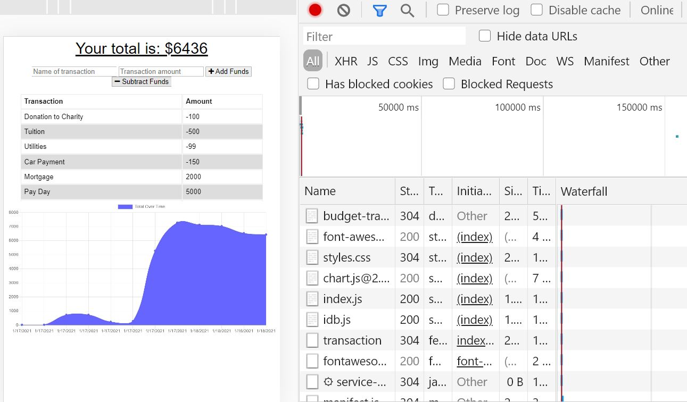
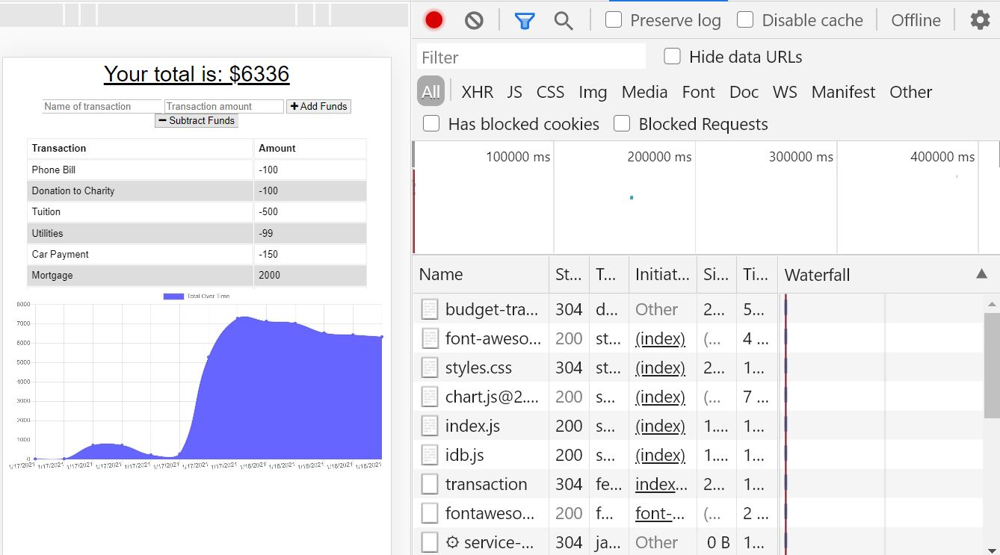
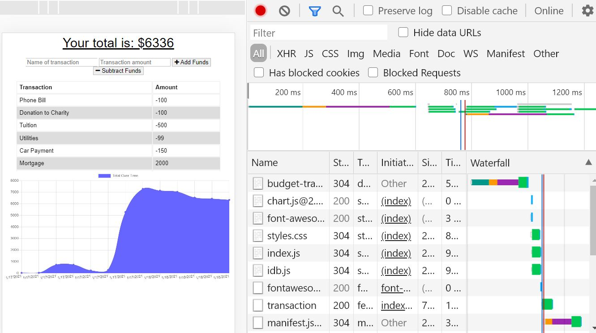

# Employee Tracker
---

## Description 

*Description of the project; including the what, the why and the how:* 

 Budget Tracker is a PWA application that allows users to track their budget in online and offline environments. 

## Table of Contents
* [Installation](#installation)
* [Usage](#usage)
* [Contributing](#contributing)
* [Tests](#tests)
* [License](#license)
---

## Installation

*Instructions required to install and run the project:*

* Clone the github respository
* npm install to install dependencies 
* npm start to run

---

## Usage 

Track your budget by inserting expenses (subtract funds) and income (add funds).

## Preview
Functionality Online
  
Functionality Offline
  
Functionality when Online connection is reinstated after offline posts added.
  
[Deployed Heroku App!](https://budget-tracker-pwa33.herokuapp.com/)
---

## Tests

*Tests used and how they are ran:*
---

## License

undefined

---

## Questions?

For any questions, please feel free to reach out to me:

GitHub: [@asanchez325](https://api.github.com/users/asanchez325)